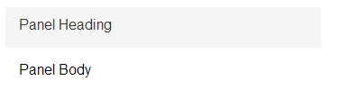
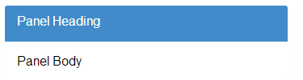
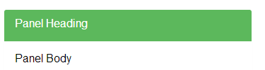
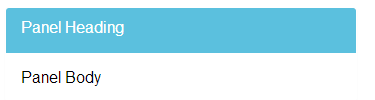
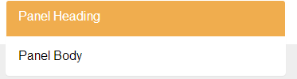
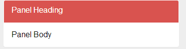

# &lt;bootstrap-panel&gt;

> A web component to show a bootstrap-panel.

[See the demo](http://jethro91.github.io/bootstrap-panel/)

just use this tag to create an awesome bootstrap panel
```html

<bootstrap-panel>
  <h3>Panel Heading</h3>
  Panel Content
</bootstrap-panel>

```
and taraaa.... now you have an awesome bootstrap panel 

without panel heading
---

```html

<bootstrap-panel>
  Panel Content
</bootstrap-panel>

```

Color Selection
---
```html
<bootstrap-panel bscolor="default">
  <h3>Panel Heading</h3>
  Panel Body

</bootstrap-panel>
```


```html
<bootstrap-panel bscolor="primary">
  <h3>Panel Heading</h3>
  Panel Body

</bootstrap-panel>
```


```html
<bootstrap-panel bscolor="success">
  <h3>Panel Heading</h3>
  Panel Body

</bootstrap-panel>
```

```html
<bootstrap-panel bscolor="info">
  <h3>Panel Heading</h3>
  Panel Body

</bootstrap-panel>
```

```html
<bootstrap-panel bscolor="warning">
  <h3>Panel Heading</h3>
  Panel Body

</bootstrap-panel>
```

```html
<bootstrap-panel bscolor="danger">
  <h3>Panel Heading</h3>
  Panel Body

</bootstrap-panel>
```


